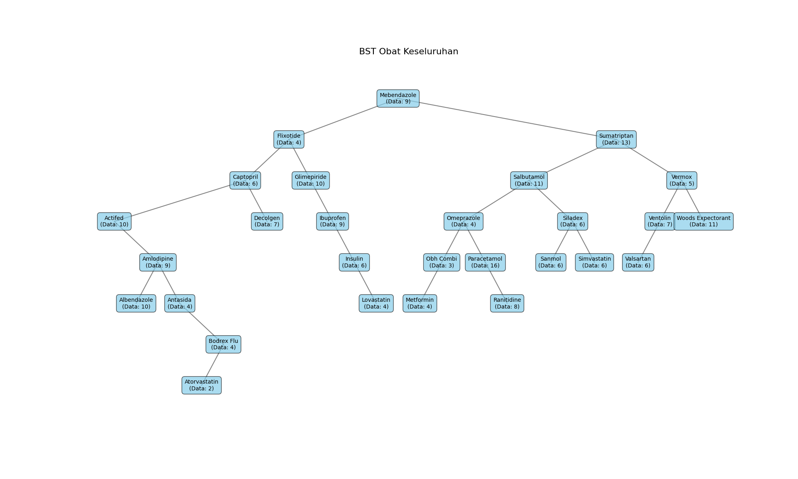

# IY MEDSFINDER

**IY MEDSFINDER** is a smart digital pharmacy application developed to help users search for medicine records efficiently using a **Binary Search Tree (BST)**.

This project was developed as part of the **Data Structures and Algorithms** course, with a focus on implementing tree-based data structures for medicine search and data organization.



## Project Overview

Searching medicine data sequentially can become less efficient as the amount of data increases. This project implements a **Binary Search Tree (BST)** to organize medicine names and support efficient searching based on the medicine name.

IY MEDSFINDER allows users to search for a medicine through an interactive interface and view the related ordering records, including:

- Customer name
- Disease category
- Order date
- Number of records associated with a medicine

The application also provides a visualization of the BST structure to make the organization of medicine data easier to understand.

## Objectives

The main objectives of this project are:

- Implement a Binary Search Tree for organizing medicine data.
- Apply BST insertion and search operations.
- Provide an application for searching medicine records.
- Display medicine data in an easy-to-understand format.
- Visualize the structure of the Binary Search Tree.
- Demonstrate the practical application of data structures in a pharmacy-related use case.

## Key Features

### Medicine Search

Users can search for a medicine by entering or selecting its name.

### Medicine Record Display

The search results display relevant information associated with the selected medicine:

| Information | Description |
|---|---|
| Nama Pemesan | Name of the customer |
| Kategori Penyakit | Disease category |
| Tanggal Pesan | Order date |

### Binary Search Tree Implementation

Medicine names are organized into a Binary Search Tree based on alphabetical ordering.

Each BST node stores:

- Medicine name
- Associated medicine records
- Left child
- Right child

When multiple records belong to the same medicine, the records are stored within the corresponding node.

### BST Visualization

The project includes a visualization of the Binary Search Tree showing the medicine names and the number of records stored in each node.

### Interactive Interface

The application uses **Gradio** to provide an interactive interface for searching medicine records.

## Dataset

The project uses a dataset containing **200 medicine-order records**.

The dataset contains the following attributes:

| Column | Description |
|---|---|
| Nama Pemesan | Name of the customer |
| Kategori Penyakit | Disease category |
| Nama Obat | Medicine name |
| Tanggal Pesan | Order date |

The dataset contains multiple disease categories and medicine names that are organized into the Binary Search Tree.

## Data Structure

The main data structure used in this project is a **Binary Search Tree (BST)**.

The medicine name is used as the key for determining the position of each node.

The basic structure can be represented as:

```text
                Medicine
                /      \
        Smaller Name   Larger Name
             /              \
          ...                ...
```

When a medicine already exists in the tree, its related records are stored within the existing node rather than creating another node for the same medicine.

## Technology Stack

- **Python**
- **Pandas** — data loading and manipulation
- **Matplotlib** — BST visualization
- **Gradio** — interactive application interface
- **Graphviz DOT** — representation of the BST structure

## Project Structure

```text
iy-medsfinder/
│
├── assets/
│   └── obat.png
│
├── data/
│   └── DATA SDA.csv
│
├── src/
│   └── main.py
│
├── bst_obat_visualization
│
├── requirements.txt
│
└── README.md
```

## How It Works

The application follows these main steps:

1. Load medicine-order data from the CSV dataset.
2. Create an empty Binary Search Tree.
3. Insert medicine records into the BST based on medicine names.
4. Store multiple records belonging to the same medicine in the corresponding node.
5. Allow users to search for a medicine.
6. Traverse the BST to locate the requested medicine.
7. Display the associated medicine records through the application interface.
8. Visualize the resulting BST structure.

## Example

For example, if the user searches for:

```text
Paracetamol
```

the application searches the Binary Search Tree for the corresponding node and displays the records associated with Paracetamol.

The BST visualization also indicates the number of records stored for each medicine.

## Project Context

**Course:** Data Structures and Algorithms  
**Project:** Smart Digital Pharmacy Application  
**Application:** IY MEDSFINDER  
**Programming Language:** Python

## Project Team

- **Annisa Ramadhani**
- **Yanaka Sofia Pardede**

## Learning Outcomes

Through this project, the implementation of a Binary Search Tree was applied to a practical data-search problem. The project demonstrates how fundamental data structures can be combined with data processing, visualization, and an interactive interface to create a functional application.
